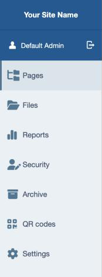
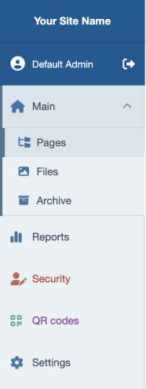

# Silverstripe Better Menu

Polish the Silverstripe CMS **left menu**: replace the section icons with **Font Awesome** ones,
set their colour and opacity, swap the profile/logout icons, tidy the alignment — and, optionally,
organise sections into **collapsible groups** — all configured in YAML.

Out of the box it loads Font Awesome Free and applies a curated set of icons to the core CMS
sections (no grouping needed). Everything is overridable, grouping is opt-in, and Font Awesome can
be disabled or swapped for your Pro kit.



## Requirements

- Silverstripe Framework **6** / Admin **3**
- PHP **8.3+**

## Installation

```bash
composer require xddesigners/silverstripe-better-menu
```

Run `dev/build?flush=1` once.

## How it works

Each CMS menu section renders its icon from the admin controller's `menu_icon_class` config. The
module loads Font Awesome into the CMS and overrides `menu_icon_class` for the classes in its
`menu_icons` map (via a `LeftAndMain` extension). Colours, opacity and the profile/logout icons are
layered on with a small CSS/JS requirement.

Grouping (below) additionally overrides a single admin template include
(`SilverStripe/Admin/Includes/LeftAndMain_MenuList.ss`) to render the collapsible groups. With no
groups configured the menu stays flat — just restyled — so you can use the module purely for icons.

## Menu groups & per-item styling

Define the whole menu as an ordered tree: group sections into collapsible fold-outs and style each
item. Groups with 2+ present items become collapsible; a group **auto-expands** when one of its
sections is active and **auto-collapses** when you navigate elsewhere (the chevron also toggles it
by hand). Sections you don't list keep their native position.



```yaml
XD\BetterMenu\BetterMenu:
  menu:
    - group: 'Main'
      icon: 'fa-solid fa-house'
      children:
        - section: 'SilverStripe\CMS\Controllers\CMSMain'
        - section: 'SilverStripe\AssetAdmin\Controller\AssetAdmin'
        - section: 'SilverStripe\VersionedAdmin\ArchiveAdmin'
    - section: 'SilverStripe\Admin\SecurityAdmin'
      color: '#c0392b'          # red icon + red text
    - section: 'App\Admin\ThingAdmin'
      icon: 'fa-solid fa-cube'
      icon_color: '#16a085'     # teal icon
      text_color: '#8e44ad'     # purple text
```

**Group node** keys:

| Key            | Effect                                                            |
|----------------|-------------------------------------------------------------------|
| `group`        | The group label shown in the menu (translatable).                 |
| `icon`         | The group's icon (Font Awesome classes or a `font-icon-*` name).  |
| `children`     | List of `section` nodes in the group.                             |
| `priority`     | Optional sort priority (higher sorts first).                      |
| `alphabetical` | `true` to sort the group's children A–Z (default: config order).  |

**Section node** keys (usable on a top-level `section` or inside a group's `children`):

| Key          | Effect                                                                      |
|--------------|-----------------------------------------------------------------------------|
| `section`    | The admin controller class.                                                 |
| `icon`       | Font Awesome classes or a `font-icon-*` name.                               |
| `color`      | Base colour — the icon **and** the text both follow it.                     |
| `icon_color` | Override just the icon colour (falls back to `color`).                      |
| `text_color` | Override just the text colour (falls back to `color`).                      |
| `opacity`    | Icon opacity, `0`–`1`.                                                       |

The `menu` tree layers on top of (and overrides) the simple `menu_icons` map below, so you can set
icons globally and only reach for the tree when you want grouping or per-item colours.

### Migrating from grouped-cms-menu

Better Menu also reads the legacy `LeftAndMain.menu_groups` format (from
[silverstripe-grouped-cms-menu](https://github.com/xddesigners/silverstripe-grouped-cms-menu)), so
existing config keeps working:

```yaml
SilverStripe\Admin\LeftAndMain:
  menu_groups:
    'Shop':
      items:
        - 'App\Admin\ProductAdmin'
        - 'App\Admin\OrderAdmin'
      icon_class: 'fa-solid fa-bag-shopping'
      priority: 100
      alphabetical: true
```

New projects should prefer the richer `menu` tree above (it adds per-item colours and ordering).

> **Template note:** grouping works by overriding the `LeftAndMain_MenuList.ss` include. If your
> project (or another module) already overrides that same include, merge this module's version in.

## Configuring the icons

For the simple case — just icons, no grouping — set them per admin class. The map is deep-merged
with the module's defaults, so you only list what you want to change:

```yaml
XD\BetterMenu\BetterMenu:
  menu_icons:
    'App\Admin\ProductAdmin': 'fa-solid fa-box'
    'App\Admin\OrderAdmin': 'fa-solid fa-receipt'
    # Keep the built-in webfont for one section by using a font-icon name:
    'SilverStripe\Reports\ReportAdmin': 'font-icon-chart-line'
```

The value is either Font Awesome classes (e.g. `fa-solid fa-box`) or a CMS `font-icon-*` name.

### Curated defaults

The module ships these defaults (override any of them as above):

| Section  | Class                                             | Icon                      |
|----------|---------------------------------------------------|---------------------------|
| Pages    | `SilverStripe\CMS\Controllers\CMSMain`            | `fa-solid fa-folder-tree`     |
| Files    | `SilverStripe\AssetAdmin\Controller\AssetAdmin`   | `fa-solid fa-image` |
| Reports  | `SilverStripe\Reports\ReportAdmin`                | `fa-solid fa-chart-simple`  |
| Security | `SilverStripe\Admin\SecurityAdmin`                | `fa-solid fa-user-pen`       |
| Archive  | `SilverStripe\VersionedAdmin\ArchiveAdmin`        | `fa-solid fa-box-archive` |
| Settings | `SilverStripe\SiteConfig\SiteConfigLeftAndMain`   | `fa-solid fa-gear`        |
| ModelAdmin (default) | `SilverStripe\Admin\ModelAdmin`       | `fa-solid fa-table-list`  |

## Profile & logout icons

The user and logout icons at the top of the CMS menu aren't menu-icon-classes, so give them
Font Awesome classes separately (swapped in client-side). The profile name is also left-aligned
with the menu titles.

```yaml
XD\BetterMenu\BetterMenu:
  profile_icon: 'fa-solid fa-circle-user'
  logout_icon: 'fa-solid fa-right-from-bracket'
```

## Icon colour & opacity

The menu icons default to the SilverStripe dark-blue header colour. Override the global colour
and/or opacity (per-item colours in the `menu` tree take precedence):

```yaml
XD\BetterMenu\BetterMenu:
  icon_color: '#005a93'   # any CSS colour (default: SS dark blue); empty keeps the CMS default
  icon_opacity: 0.8       # 0–1 (default: 0.8)
```

## Font Awesome: disable or use Pro

Font Awesome Free is loaded from cdnjs by default. Turn it off, or point at your own Pro kit/CSS:

```yaml
XD\BetterMenu\BetterMenu:
  # Disable all Font Awesome loading (use CMS font-icons only in your map):
  include_fontawesome_free: false

  # …or load Font Awesome Pro instead, then use Pro classes (fa-thin, fa-duotone, …) in menu_icons:
  fontawesome_css: 'https://kit.fontawesome.com/XXXX.css'
```

If you also use [silverstripe-better-tabs](https://github.com/xddesigners/silverstripe-better-tabs),
both load the same cdnjs stylesheet — Silverstripe de-duplicates it, so it's only fetched once.

## Caveat

A section that sets a `menu_icon` **image** (rather than a `menu_icon_class`) keeps that image —
the class override doesn't apply to it. The core sections above all use a class, so they theme
cleanly.

## License

BSD-3-Clause.
